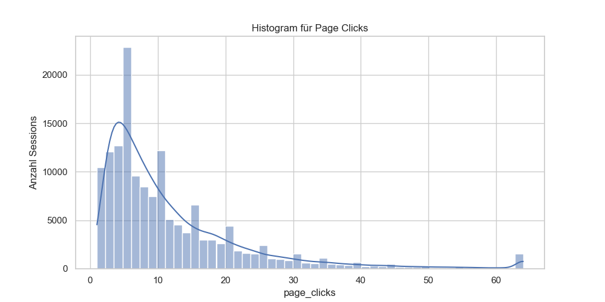
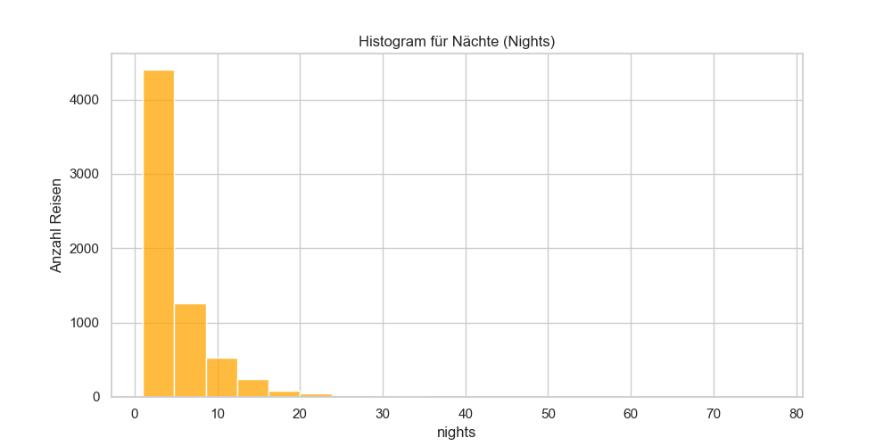
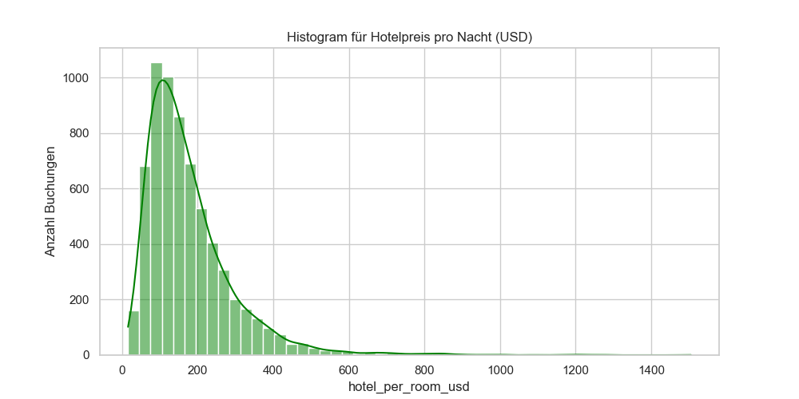

# Mastery Projekt: TravelTide Kundensegmentierung
**Datengesteuerte Entscheidungsfindung & Machine Learning**

*Erstellt von: Mazen*

---

## 1. Problemstellung & Ziel

**Die Ausgangslage:**
TravelTide verfügt über umfangreiche Daten aus Web-Traffic (Sessions) und tatsächlichen Buchungen (Flüge & Hotels). 

**Das Ziel:**
Kundenpräferenzen besser verstehen, um **zielgerichtete Vergünstigungen (Perks / Gutscheine)** anzubieten und so die Kundenbindung (Retention) zu erhöhen.

---

## 2. Die Datenbasis

Wir nutzen 4 Kern-Tabellen aus einer PostgreSQL-Datenbank:

- **Users:** Demografische Daten
- **Sessions:** Web-Traffic, Seitenklicks, aufgerufene Angebote
- **Flights:** Flugbuchungen, Preise, Gepäck, Sitze
- **Hotels:** Hotelbuchungen, Nächte, Zimmer, Preise

*(Basis-Kohorte: Alle aktiven Nutzer der letzten Monate)*

---

## 3. Preprocessing, Data Cleaning & GIGO

> **"Garbage In, Garbage Out" (GIGO)**
> Die Qualität der Segmentierung ist nur so gut wie die Datenbasis. Um zu verhindern, dass fehlerhafte Einträge die Ergebnisse des Machine Learnings (K-Means) verfälschen, wurde eine rigorose Datenreinigung und ein automatisiertes Software-Testing (`pytest`) integriert.

Echte Daten sind nicht perfekt. Daher wurden unter anderem folgende Bereinigungen automatisch per Python (`pandas`) durchgeführt:

- **Fehlerhafte Aufenthalte:** Negative Hotel-Nächte wurden korrigiert (`ABS`).
- **Logik-Fehler:** Vertauschte Check-In / Check-Out Daten wurden getauscht. 0 Nächte/Sitze bei erfolgreicher Buchung wurden auf 1 gesetzt.
- **Ausreißer-Behandlung:** Extreme Web-Aktivität (`page_clicks`) wurde mithilfe der IQR-Methode (Interquartile Range) beschnitten ("Clipping").

---

## 4. Explorative Datenanalyse (Histogramme)

Um ein erstes Gefühl für die Verteilung unserer Nutzer zu bekommen, betrachten wir drei Kern-Metriken:

**Page Clicks (Web-Traffic):**
Die große Menge der Nutzer bewegt sich im Bereich von 0-40 Klicks. Dank unseres Preprocessings (IQR-basierendes Clipping) haben wir extreme Ausreißer (>95 Klicks) erfolgreich minimiert.

---

## 4. Explorative Datenanalyse (Histogramme)

**Nächte pro Reise (Nights):**
Wir sehen ganz klar, dass die absolute Mehrheit aller angetretenen Reisen **Kurztrips** (1-3 Nächte) sind. Reisen über 10 Tage hinaus sind extreme Seltenheit.

---

## 4. Explorative Datenanalyse (Histogramme)

**Hotel-Preis pro Nacht (Room USD):**
Die Preise der gebuchten Hotels weisen eine gesunde, log-normale Verteilung auf. Ein Großteil der Buchungen findet im günstigen/mittleren Segment (unter 200$) statt.

---

## 5. Feature Engineering

Um Machine Learning anwenden zu können, wurden die Interaktionen auf **User-Ebene** (1 Zeile = 1 Kunde) aggregiert:

- **Klick- & Surfverhalten:** `total_sessions`, `window_shopping_rate`, `cancellation_rate`
- **Ausgaben:** `total_spent` (Flug + Hotel)
- **Kunden-Annahmen (Ratios):** 
  - *Business-Trip-Ratio* (Fliegt alleine, wenig Gepäck, kurzer Hotelaufenthalt)
  - *Family-Trip-Ratio* (> 2 Sitze oder mehrere Hotelzimmer)

---

## 5. Methodik: Unsupervised Machine Learning

Wir suchen nach Mustern in den Daten, ohne das Ergebnis vorher zu kennen.

1. **Feature Scaling (`StandardScaler`):** Alle Features wurden standardisiert, damit Beträge in Dollar nicht die Raten/Prozente erdrücken.
2. **K-Means Clustering:** Einteilung der Kunden in **4 Hauptsegmente** (bewertet durch die *Elbow Methode*).
3. **Dimensionality Reduction (`PCA`):** Komprimierung der 9 Dimensionen auf 2 Achsen, um die Segmente visuell darzustellen.

---

## 6. Die identifizierten Kundensegmente

Das Clustering ergab fünf charakteristische Gruppen (Customer Personas):

- **Cluster 0 (Young Window Shopper):** Junge Singles (~32 J.), sehr hohe "Stöber-Rate" (82%), geringste Ausgaben (~1230$).
- **Cluster 1 (Frühbucher & Discount-Seeker):** Buchen >2 Monate im Voraus (65 Tage Lead Time) und höchste Storno-Rate (12%).
- **Cluster 2 (Premium Familienurlauber):** Höchste Family-Trip-Ratio (52%). Längste Aufenthalte (~6,6 Nächte).
- **Cluster 3 (Vielreisende & Business):** 58% Business-Trip-Ratio. Kurze Vorlaufzeit (~9 Tage). Hohe Ausgaben (~4500$).
- **Cluster 4 (Ältere verheiratete Urlauber):** Älteste Gruppe (~52 J.), meist verheiratet (93%), spontane Kurztrips ohne Kinder.

*(Hinweis: Auf dieser Basis baut unsere gesamte Strategie auf!)*

---

## 7. Maßgeschneiderte Perks (Gutschein-Strategie)

Basierend auf den errechneten Clustern weisen wir nun jedem Kunden dynamisch den passenden Perk zu:

- **Cluster 0 (Young Window Shopper):** *Exclusive discounts* (Direkte finanzielle Anreize zur Konvertierung junger Singles).
- **Cluster 1 (Frühbucher):** *No cancellation fees* (Sicherheit bei langfristigen Buchungen, fängt die hohe Storno-Rate auf).
- **Cluster 2 (Familien):** *1 night free hotel with flight* (Höchster Zusatznutzen für Familien mit sehr langen Hotel-Aufenthalten).
- **Cluster 3 (Business):** *Free hotel meal* (Die Firma bucht meist Flug/Hotel, aber Essen ist ein guter Bonus für Vielreisende).
- **Cluster 4 (Ältere Paare):** *Free checked bag* (Erleichtert das Packen für Paare, die spontan einen Kurzurlaub antreten).

Ziel: Den Customer Lifetime Value (CLV) strategisch steigern.

---

## 8. Erfolgsmessung (KPIs der nächsten Monate)

Um den konkreten Return on Investment (ROI) der Segmentierung zu belegen, sollten folgende A/B-Tests gemonitort werden:

1. **Conversion-Rate bei Window Shoppern (Kauf-Aktivierung):** Signifikanter Anstieg der erfolgreichen Flug-Buchungen.
2. **Storno-Quote bei Frühbuchern:** Deutlicher Rückgang der Stornierungen (unter die aktuellen 12%).
3. **Gutschein-Einlösequote (Redemption Rate):** Höhere Akzeptanz der Perks durch personenspezifische Ausspielung.
4. **Customer Lifetime Value (CLV):** Konstante Loyalität (Up-Selling) der High-Spender nach dem Checkout.

---

## Vielen Dank für die Aufmerksamkeit!

**Fragen?**
